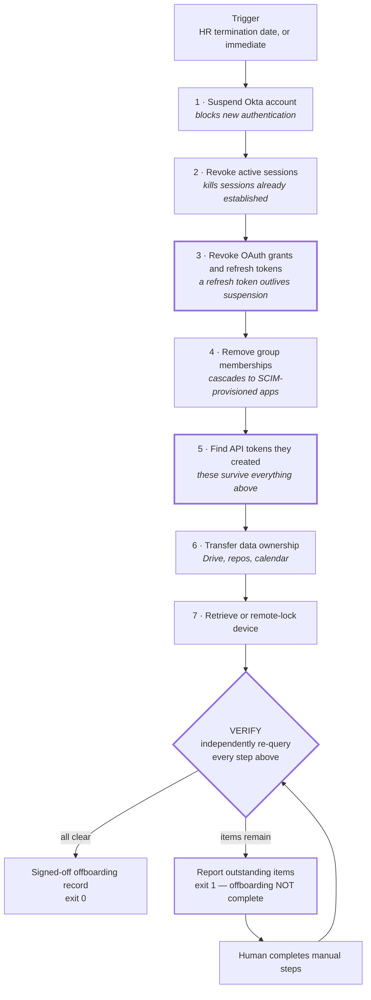
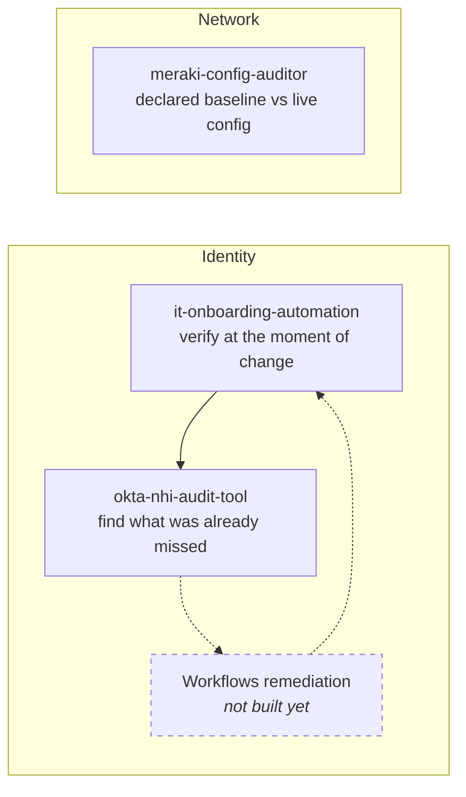

# it-onboarding-automation

A designed joiner-mover-leaver process for a 50-person startup, plus the tooling
that runs the leaver half of it — and, more importantly, **verifies its own
work**.

Most offboarding scripts suspend an account, log a success, and move on. This
one re-queries the tenant afterwards and tells you what's still standing. It
exits non-zero when anything is, because *an offboarding script that doesn't
verify its own work is just optimism with a shebang*.

```console
$ python src/offboard.py --demo
```

```
OFFBOARDING REPORT — jdoe@example.com
Initiated 2026-08-15 14:32 by michael@example.com

ACTIONS
  ✅ Okta account suspended
  ✅ Sessions revoked (3 recent sign-ins)
  ✅ 2 OAuth refresh tokens revoked
  ✅ Removed from 7 groups
  ✅ Google Drive ownership → manager@example.com

VERIFICATION (independent re-query)
  ✅ Authentication blocked
  ✅ No sign-ins since sessions were revoked
  ✅ No valid refresh tokens
  ⚠️  Still assigned to: Zoom  (not SCIM-managed — manual removal required)
  🔴 API token "jenkins-integration" created by this user is STILL ACTIVE
      → this token survives account suspension. Revoke separately:
        Security → API → Tokens

RESULT: 2 items require manual action. Offboarding is NOT complete.
```

Those last two lines are the whole point. Both findings are real Okta
behaviours that a script trusting its own HTTP 200s would report as a clean
offboard:

- **Zoom isn't SCIM-provisioned.** Removing group memberships returned 200 and
  changed nothing about the Zoom account. Nothing errored. Nothing told you.
- **API tokens outlive their creator's account.** An Okta API token created by
  a user keeps working after that user is suspended, deactivated, or deleted.
  A `jenkins-integration` token made by a departing engineer three years ago is
  still authenticating this morning, and whoever inherited CI has no idea its
  owner has left.

---

## Try it

No credentials, no network, no Okta tenant required.

```bash
git clone https://github.com/michaeljavyee/it-onboarding-automation
cd it-onboarding-automation
python src/offboard.py --demo
```

Demo mode runs the identical code path as a live run — the same client
interface, the same action sequence, the same verification pass — against a
JSON fixture instead of a tenant. A demo that branches somewhere else proves
nothing about the branch that matters.

Watch the safety rail refuse an admin account:

```bash
python src/offboard.py --demo --fixture leaver_admin.json
# REFUSED: Refusing to modify admin@example.com: account holds SUPER_ADMIN, ORG_ADMIN.
```

Against a real tenant (a free Okta Developer org is enough):

```bash
cp .env.example .env      # fill in OKTA_ORG_URL and OKTA_API_TOKEN
python src/offboard.py --user jdoe@example.com            # dry run — default
python src/offboard.py --user jdoe@example.com --apply     # writes
```

---

## The leaver flow



Step 3 is the one that gets skipped. Suspending an account is an
**authentication** control — and a refresh token already issued is not
authentication. The holder can keep minting access tokens without ever
authenticating again. In Okta the fix is the `oauthTokens=true` parameter on
the session-clear call, which is not the default.

Full reasoning, including why the steps are in that order and what stays manual:
**[docs/flows/leaver.md](docs/flows/leaver.md)**.

---

## Safety rails

This is the only project of mine that writes to Okta, so the rails came before
the features. All four live in [`src/safety.py`](src/safety.py), isolated and
tested on their own.

| Rail | Behaviour |
|---|---|
| **Dry run by default** | Nothing writes without `--apply`. Dry runs still produce the full action list. |
| **Admin refusal** | Any account holding an admin role is refused outright unless `--i-know-this-is-an-admin` is passed. |
| **Typed confirmation** | `--apply` against a live tenant prompts for the target's full login, typed out. |
| **Append-only audit log** | Every action — including intended ones from dry runs — is written to `audit-log/YYYYMMDD.jsonl` with operator, target, and timestamp. |

The destructive path takes three explicit steps to reach. That's the answer to
"how do you avoid breaking prod?"

---

## The role-access matrix

The artifact I actually reference in conversation. Abbreviated here; the full
version with SCIM coverage, review cadence, and reasoning is in
**[docs/role-access-matrix.md](docs/role-access-matrix.md)**, and its
machine-readable twin is [`config/roles.yml`](config/roles.yml).

| | Engineer | Sales | Finance | Contractor |
|---|---|---|---|---|
| Okta group | `eng-all` | `sales-all` | `finance-all` | `contractors` |
| Google Workspace | ✅ | ✅ | ✅ | ✅ no external share |
| Slack | ✅ | ✅ | ✅ | ✅ single-channel guest |
| GitHub | ✅ write | ❌ | ❌ | ✅ read, time-boxed |
| AWS | ✅ dev, prod read | ❌ | ❌ | ❌ |
| Salesforce | ❌ | ✅ | ✅ read | ❌ |
| NetSuite | ❌ | ❌ | ✅ | ❌ |
| MDM profile | `eng-baseline` | `standard` | `finance-hardened` | `contractor` (BYOD) |
| Hardware | MBP 16" | MBP 14" | MBP 14" | BYOD |
| **Access expiry** | — | — | — | **90 days, auto-suspend** |

Two rows that usually go missing: the **contractor column** (they arrive
through a different path, use BYOD, and end on a project milestone rather than
a termination notice) and the **expiry row** (which turns "does this contractor
still need GitHub?" from a question nobody asks into one the system asks on a
schedule).

---

## Decision log

Six choices where a real alternative existed, and what each one cost.
Full versions in **[docs/decision-log.md](docs/decision-log.md)**.

1. **Accounts created the evening before start, in `STAGED` state** — not at
   offer signature. A live credential for someone who hasn't started, hasn't
   signed an AUP, and might not show up is worse than an overnight batch.
2. **Group-based assignment only.** Direct app assignments are invisible to the
   mover diff and to access reviews, which is how five-year employees accrue
   access nobody can explain. Costs ten minutes per one-off request; worth it.
3. **Non-SCIM apps are reported, not automated.** Three more integrations and
   three more stored write credentials, to save twelve manual removals a month,
   with a failure mode that looks like success. Revisit at ~150 people.
4. **Verification over return codes.** Every interesting failure here returns
   200 — the API did what was asked, the request just wasn't sufficient.
5. **Same-day for involuntary, end-of-day for voluntary.** Different risk
   profiles; treating them identically over-serves one and under-serves the
   other. The tool takes departure type as input and lets a human decide.
6. **Device baselines as code, not an MDM trial.** MDM reporting tells you a
   profile was *delivered*, not that it's currently *effective*.

---

## How this connects to my other work

Three repos, one idea: **the system reported success and left something behind.**

This repo is the one that says it out loud. Suspend the account, get `200`, close
the ticket — and the API token that engineer created three years ago is still
authenticating this morning. The verification pass exists because the success
response is not the evidence.

An orphaned API token created by a departed employee is simultaneously an
**offboarding failure** and a **non-human-identity finding**. `offboard.py`
surfaces it at the moment of departure;
[`okta-nhi-audit-tool`](https://github.com/michaeljavyee/okta-nhi-audit-tool) finds the
ones that were already missed. `src/okta_client.py` follows that project's HTTP
and pagination patterns; the differences are the write methods, which that
project deliberately did not have, and failing fast on rate limits instead of
retrying, because replaying a write is not harmless.



| Repo | Catches | The lie it doesn't believe |
|---|---|---|
| **it-onboarding-automation** (this repo) | Leaver actions that returned success but didn't take effect | "HTTP 200 means it happened" |
| [okta-nhi-audit-tool](https://github.com/michaeljavyee/okta-nhi-audit-tool) | Machine identities no access review has ever covered | "We review access quarterly" |
| [meraki-config-auditor](https://github.com/michaeljavyee/meraki-config-auditor) | Config drift between declared intent and live network state | "Dashboard shows the switch green" |

**The honest gap:** the dotted arrow is Okta Workflows — take a finding, notify
the owner, open a ticket, revoke after a grace period, so detection closes into
action instead of ending in a report. Not built yet. It's the next thing.

---

## Repo layout

```
it-onboarding-automation/
├── README.md
├── config/roles.yml            ← the access matrix, machine-readable
├── docs/
│   ├── role-access-matrix.md
│   ├── decision-log.md
│   └── flows/leaver.md         ← + Mermaid diagram
├── fixtures/                   ← demo data; no credentials needed
├── src/
│   ├── okta_client.py          ← real + demo clients behind one interface
│   ├── offboard.py
│   └── safety.py               ← the guardrails, isolated and tested
├── mdm/                        ← baselines as code (see mdm/README.md)
└── tests/
```

## Status

Shipped and working: the leaver flow, the role matrix, the decision log,
`offboard.py` with full verification, and the safety rails, all covered by
tests and demoable with zero credentials.

Deliberately not built yet — a coherent 40% beats a thin 90%:

- [ ] `onboard.py` and the joiner flow doc
- [ ] `access_review.py` — quarterly who-has-what export
- [ ] Mover flow, and the add/remove diff that goes with it
- [ ] `mdm/` compliance scripts (approach documented; scripts to follow)
- [ ] Live-tenant Google Workspace adapter for Drive ownership transfer

```bash
python -m pytest tests/ -q     # 16 passed
```

Nothing in this repo comes from any real employer. The company, the users, and
the tokens are all invented.
