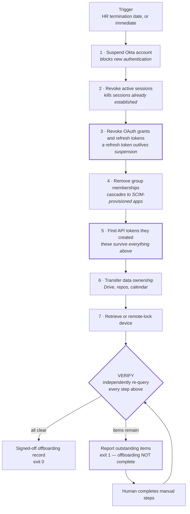

# Leaver flow

The question this flow exists to answer is not *"did we offboard them?"* It is
*"how do we know?"* Those are different questions, and only the second one
survives an audit.

## Trigger

| Departure type | Trigger | Timing |
|---|---|---|
| Voluntary, notice given | BambooHR termination date | Deprovision at 17:00 local on the last working day |
| Involuntary | Manual initiation by IT lead or People | Immediate, and ideally *before* the conversation ends |
| Contractor end-of-engagement | 90-day expiry or sponsor closure | Auto-suspend at expiry |
| Contractor renewal lapse | No renewal by day 90 | Auto-suspend, 30-day grace before deprovision |

Involuntary departures are the case the design has to accommodate, because
that's when the gap between "account suspended" and "actually lost access"
gets exploited. Everything below is ordered to close that gap fastest first.

## The sequence

The three emphasised boxes are the ones that separate this from a checklist.

## Why the order is the order

**1 before 2.** Suspend first so that no new session can be established in the
window between clearing sessions and blocking authentication. Reverse the order
and you leave a race.

**3 is the step people miss.** Suspending an account blocks *authentication*.
It does not necessarily invalidate an OAuth refresh token that was issued
before the suspension. A refresh token is a bearer credential — the app holding
it can keep minting access tokens without the user ever authenticating again.
So a departed employee's laptop can keep syncing Drive, or a personal
integration can keep pulling data, for as long as that grant lives. In Okta,
`DELETE /api/v1/users/{id}/sessions?oauthTokens=true` handles both; the
`oauthTokens=true` parameter is not the default and is easy to omit.

If you take one thing from this repo into an interview, take this: **suspension
is an authentication control, and tokens already issued are not authentication.**

**4 after 3.** Group removal is what cascades downstream to SCIM-provisioned
apps. Doing it before revoking grants can, on some connectors, deprovision the
app-side account while leaving the token that referenced it, which makes the
leftover harder to find.

**5 catches what 1–4 cannot touch.** An Okta API token created by this user is
a separate credential with its own lifecycle. It does not expire when the
creating account is suspended, deactivated, or deleted. A `jenkins-integration`
token created by a departing engineer three years ago keeps working — and
whoever inherits the CI system has no way to know its owner has left. This is
the direct overlap with
[`okta-nhi-audit-tool`](https://github.com/michaeljavyee/okta-nhi-audit-tool): an
orphaned token is simultaneously an offboarding failure and a non-human-identity
finding.

**6 before 7.** Reclaim the data before you lock the device, or you may find the
only copy of something was local.

## The verification stage

Everything above is what the tool *did*. The verification stage re-queries the
tenant from scratch and reports what is *still true*. It shares no state with
the action phase — it doesn't check return codes, it asks Okta again.

This matters because most of the failure modes here are silent. Group removal
returns 200 for an app that isn't SCIM-managed; the API just did what you asked,
which was to remove a group, not to deprovision an app. Nothing errors. The only
way to know is to look.

Verification checks:

| Check | Passes when |
|---|---|
| Account status | `SUSPENDED` or `DEPROVISIONED` |
| Sign-ins since sessions were revoked | none |
| OAuth grants | none |
| App assignments | none remaining, including non-SCIM apps |
| API tokens created by this user | none in `ACTIVE` status |

Anything left produces a `⚠️` (manual action available) or `🔴` (credential still
live) and the process exits non-zero. **The tool refuses to report success it
cannot prove.**

## Output

A signed-off offboarding record — see the sample in the [README](../../README.md).
It is written to be usable as audit evidence: it names the operator, timestamps
the run, lists actions and their independent verification, and states plainly
whether offboarding is complete.

## What stays manual, and why

| Step | Why not automated |
|---|---|
| Zoom, Datadog, AWS removal | Not SCIM-managed. Automating each would mean four more API integrations and four more sets of stored credentials, for four accounts a month. Reported, not automated — see decision log #3. |
| Device retrieval | Physical. Tool emits the shipping task; a human confirms receipt. |
| Google Drive ownership transfer | Requires Workspace admin credentials this tool does not hold. Currently reported as an outstanding item in live mode rather than silently claimed. |
| Final payroll / benefits | Not IT's system, and shouldn't be. |

## Known limitation

Okta has no "list active sessions for a user" endpoint. The live client
reads `user.session.start` events from the System Log instead, which is a
weaker signal than a direct query. Two things follow from that:

- **Before revocation**, the count is of recent sign-ins, not of sessions still
  open, and the report says so ("3 recent sign-ins").
- **During verification**, the tool asks for sign-ins *after* the moment
  sessions were revoked. An earlier version re-queried the same log window,
  and because log events are permanent it would have reported the old sign-ins
  as sessions "still active" on every live run. The demo fixture models
  sessions directly, so the demo couldn't show that bug; a test now simulates
  a log that keeps its history.

The System Log can lag by a few seconds, so a sign-in in the instant before
verification runs may not appear yet. Stated here rather than papered over; a
verification tool that lies about its own confidence is worse than no tool.
